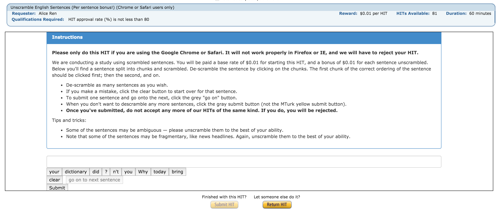

## HIT Instructions

**Please only do this HIT if you are using the Google Chrome or Safari. It will not work properly in Firefox or IE, and we will have to reject your HIT.**

We are conducting a study using scrambled sentences. You will be paid a base rate of $0.01 for starting this HIT, and a bonus of $0.01 for each sentence unscrambled. Below you'll find a sentence split into chunks and scrambled. De-scramble the sentence by clicking on the chunks. The first chunk of the correct ordering of the sentence should be clicked first; then the second, and on.

- De-scramble as many sentences as you wish.
- If you make a mistake, click the clear button to start over for that sentence.
- To submit one sentence and go onto the next, click the grey "go on" button.
- When you don't want to descramble any more sentences, click the gray submit button (not the MTurk yellow submit button).
- **Once you've submitted, do not accept any more of our HITs of the same kind. If you do, you will be rejected.**

### Tips and tricks:

- Some of the sentences may be ambiguous — please unscramble them to the best of your ability.
- Note that some of the sentences may be fragmentary, like news headlines. Again, unscramble them to the best of your ability.

## HIT Screenshot

## HIT Code

The code for our HIT, including the Python scripts used to generate sample sentences and the input CSV as well as the actual HIT (wrapped for the MTurk API), is located in this Github repository: <https://github.com/john-hewitt/scrambled>.